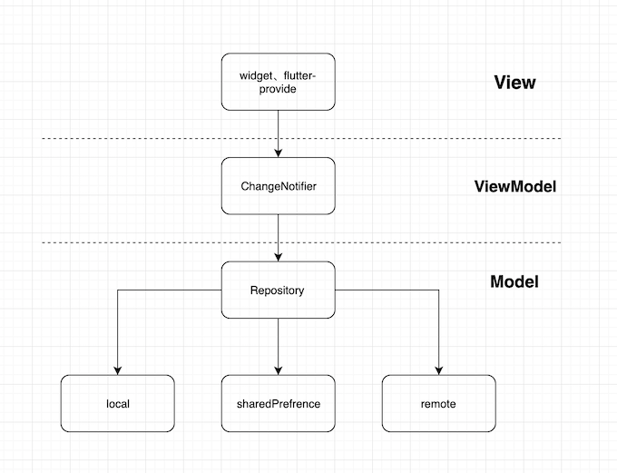

# Gametector Flutter

## MVVM Architecture

## Document
- [API](https://docs.google.com/spreadsheets/d/1J3nXlLC8TlwKb3tvU2IOlcfxRxC-awpQQ1JExk7mtYY/edit#gid=945988508)

## Tech:
- Architecture
    - MVVM Architecture
    - State manager: Provider
    - Storge: Hive/Sharedpreference
    - Third-party lib: option
- Material design
- Notification firebase

#### Dependencies

- [dio](https://github.com/flutterchina/dio) : netword
- [rxdart](https://github.com/ReactiveX/rxdart)：reactive programming
- [provider](https://github.com/rrousselGit/provider)：state managing
- [dartin](https://github.com/ditclear/dartin): dependency injection

> PS：each layer connected by rx, use responsive thinking and rxdart operators for logical processing.Finally, update the view with [provider](https://github.com/rrousselGit/provider)."# fll_demo" 
